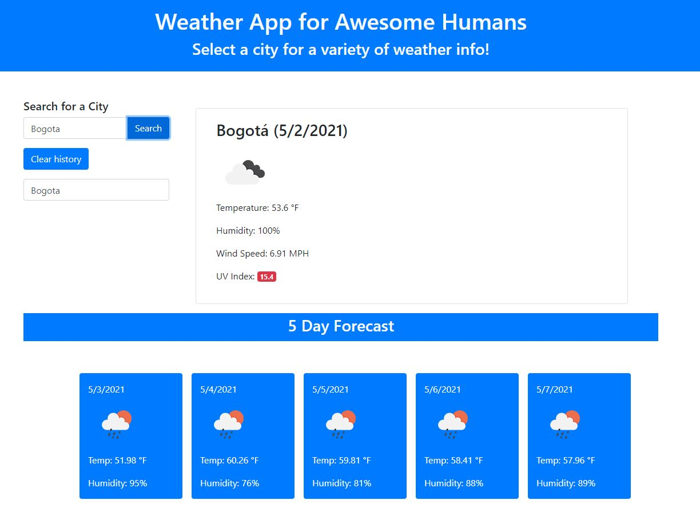

# 06 Server-Side APIs: Weather Dashboard

For this project, I was given the task of making a a weather app that can display the current weather, using a variety of metrics including wind, precipitation, and UV Index. The app also had to show a 5 day projection of weather for the dselected city. 

In completing this project, I not only hav ea functioning site, but something that can have an everyday use, and can also serve as a good reference in the future when working with APIs.

In building this page and designing it, I gained a huge appreciation for the complexities of what I have always assumed were very basic widgets or apps tht I use every day! I did not have enought time to style the page fully in the way that I would have liked, but I spent a lot of time researching how to pull data from an API.

One key takeaway that I learned this week was that reading the documentation that goes along with an API is essential to it being successful. Without knowing the syntax of how to order your requests, it is very easy to be lost so close to the finish line. I am also getting better about taking/eaving notes in my code. Prior to this I had been able to visualize the "complexities" of the site as they were mostly visual. Now that we are getting more into back-end knowledge, it is essential to write out your actions before jumping into the code sheets.

If I had to do this project again, I would do two things. One would be to improve the UI of the page. I spent too much time learning how to complete the JS sheet that I did not get time to work on the looks. As a result, it feels more basic than I would like. The second thing I would do is take more time up front and write out my workflow in the HTML/JS sheets. Preparation there would stop be from slipping into analysis paralysis, and focus on small progressions. 

LINK TO LIVE PROJECT:

https://brandoncowley.github.io/WeatherDashboard/

